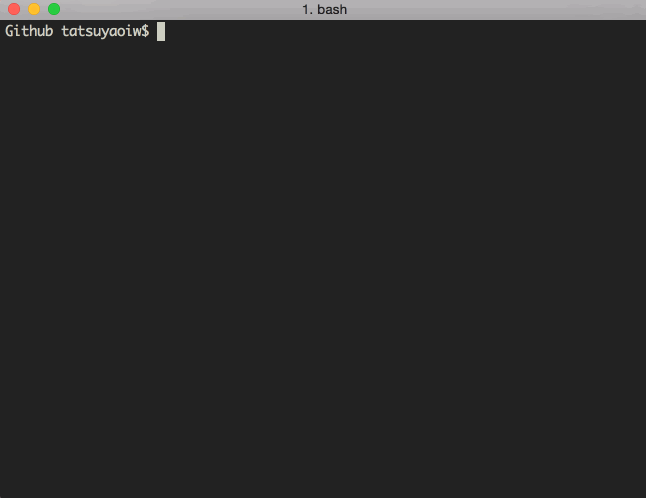

# git-pull-all

Concurrent [git pull][git-pull] executor for multiple git repositories.



[git-pull-all] is a command line tool to execute [git pull][git-pull] on multiple git repositories in parallel. Because it is asynchronous, it works really well especially for **many** projects and must be a lot faster than any synchronous ways, such as:

```sh
#!/bin/sh
find . -type d -name .git -exec sh -c "cd \"{}\"/../ && pwd && git pull" \;
```

## Installation

Using [npm]:

```
$ npm install -g git-pull-all
```

## Usage

Assume you have these files and directories:

```
~/Projects/
  cool-examples/
    .git/
  funny-movies/
  my-todos.txt
  super-express/
    .git/
```

When you run `git-pull-all` command on `~/Projects` directory, it should find child git repositories (in the above case *cool-examples* and *super-express*) then execute `git pull` on each of them.

```
$ cd ~/Projects
$ git-pull-all
funny-movies/
Not a git repository
cool-examples/
Already up-to-date.
super-express/
Already up-to-date.```

You can also specify the path where the command is executed.

```
$ git-pull-all ~/Projects
```

You can also update repositories recursively.

```
$ git-pull-all ~/Projects -r
```

Assume you have these files and directories:

```
~/Projects/
  github/
    cool-examples/
      .git/
    funny-movies/
    my-todos.txt
    super-express/
      .git/
  gitlab/
    confidential/
      .git/
```

When you run `git-pull-all -r` command on `~/Projects` directory, it should find all nested child git repositories (in the above case *cool-examples*, *super-express* and *confidential*) then execute `git pull` on each of them.

```
$ cd ~/Projects
$ git-pull-all
github/
Not a git repository
gitlab/
Not a git repository
funny-movies/
Not a git repository
cool-examples/
Already up-to-date.
confidential/
Already up-to-date.
super-express/
Already up-to-date.
```
## Licence

MIT

[git-pull]: http://git-scm.com/docs/git-pull
[git-pull-all]: https://github.com/tatsuyaoiw/git-pull-all
[npm]: https://www.npmjs.com/
